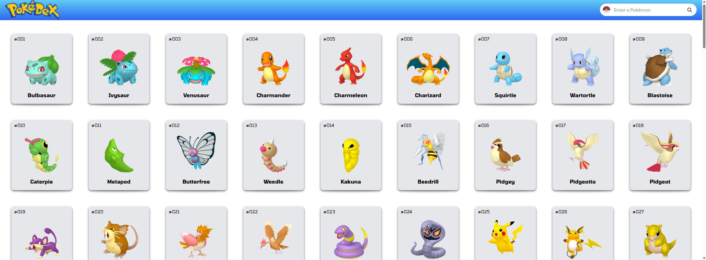
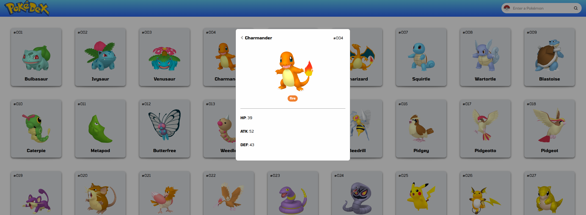

# Pokédex App

A dynamic Pokédex built with  with HTML, CSS, and JavaScript. This project displays the first 151 Pokémon from the PokéAPI. Users can search for specific Pokémon, view base stats, and see additional details in a modal popup. All images are locally hosted and styled with a responsive design.



---

## 🔗 Live Demo

[View on GitHub Pages](https://gavinnewin.github.io/pokedex/)

---

## 🚀 Features

- Browse the first 151 Pokémon
- Search Pokémon by name
- Modal popup with detailed stats
- Responsive design


---

## 🛠️ Tech Stack

- **HTML**
- **CSS**
- **JavaScript**
- **PokéAPI** for Pokémon data

---

## 📁 Folder Structure
```bash
pokemon-app/
├── images/
│   ├── pokeball.png
│   ├── pokedex.webp
│   ├── search-icon.png
│   └── pokemon-images/
│       └── [pokemon image files].png
├── screenshots/
│   ├── main.png
│   ├── modal.png
│   └── search.png
├── index.html
├── main.css
├── pokemon.js
├── README.md
```


## 📦 Installation

```bash
# Clone the repo
git clone https://github.com/gavinnewin/pokedex.git
cd pokedex

```

## 📷 Screenshots

### Homepage


### Search Functionality


### Modal Popup

